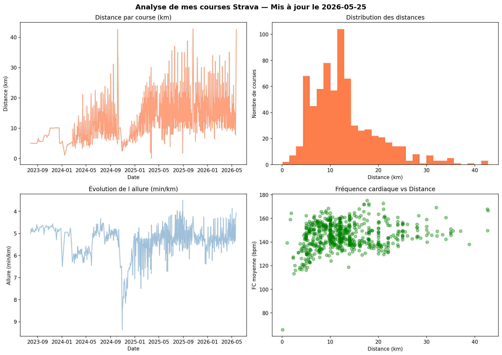
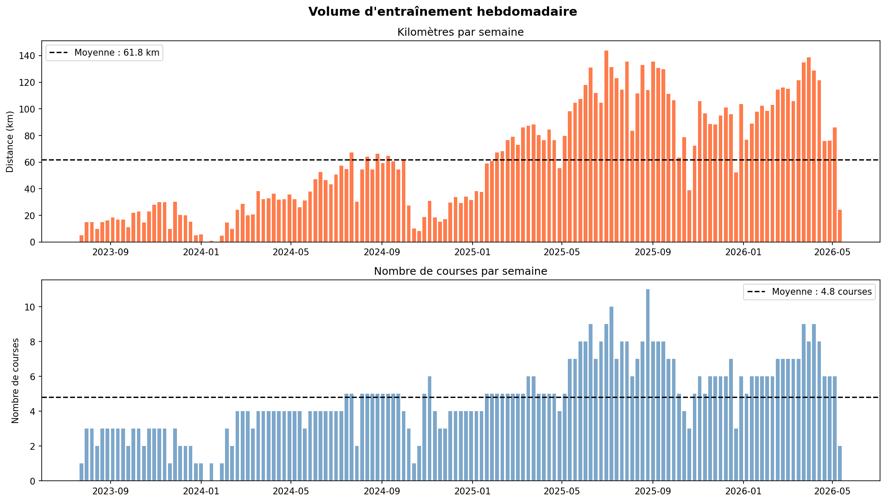
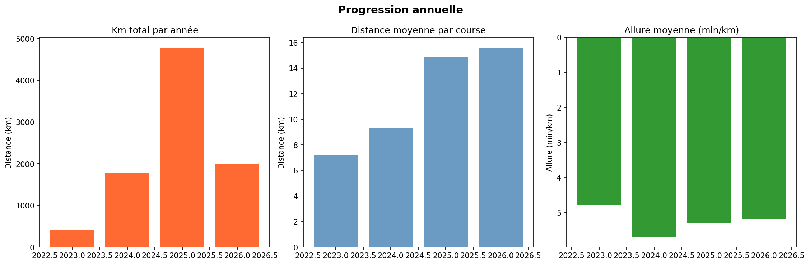
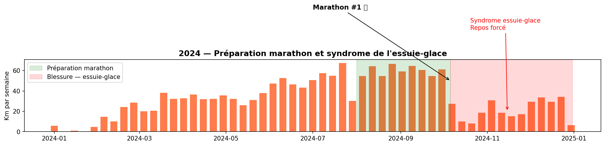
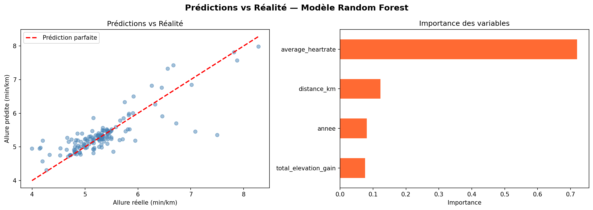

# Analyse de mes courses Strava

## Description
Analyse exploratoire et modelisation predictive de mes donnees personnelles de course
a pied extraites via l'API Strava. Ce projet demontre l'extraction via API REST (OAuth 2.0),
le nettoyage ETL, la visualisation et la modelisation Machine Learning sur des donnees reelles.

## Apercu des donnees
- 702 courses analysees depuis juillet 2023
- 12.92 km de distance moyenne par course
- 42.2 km distance maximale (marathon)
- 5:20 min/km allure moyenne
- 4787 km courus en 2025 uniquement

## Graphiques

### Vue generale

### Volume hebdomadaire

### Progression annuelle

### Histoire du marathon 2024

### Modele Machine Learning

## Modele Machine Learning
Random Forest Regressor entraine sur 561 courses (80%) et teste sur 141 courses (20%).

- MAE : 0.237 min/km (erreur moyenne de 14 secondes par km)
- R2  : 0.683 (68% de la variation d allure expliquee)

### Decouverte cle
La frequence cardiaque explique 70% de l allure — confirmant scientifiquement
l importance de l entrainement par zones cardiaques.

### Limite du modele — l humain derriere la machine
Le modele predit bien les sorties d entrainement mais sous-estime les performances
en competition (demi-marathon reel : 1h21, predit : 1h35). Cette limite demontre
un concept fondamental en ML : le biais de distribution. Les donnees d entrainement
ne capturent pas l adrenaline, la motivation en competition, ni la preparation
specifique — des facteurs humains que la machine ne peut pas mesurer seule.

## Technologies utilisees
- Python : Pandas, Matplotlib, Scikit-learn
- API Strava : Authentification OAuth 2.0
- Jupyter Notebook : Analyse interactive
- Git / GitHub : Versionnement du projet
- GitHub Actions : Mise a jour automatique chaque lundi

## Auteur
Samuel Paul - Etudiant AEC Science des donnees et BI
GitHub : https://github.com/samuelpauldata
